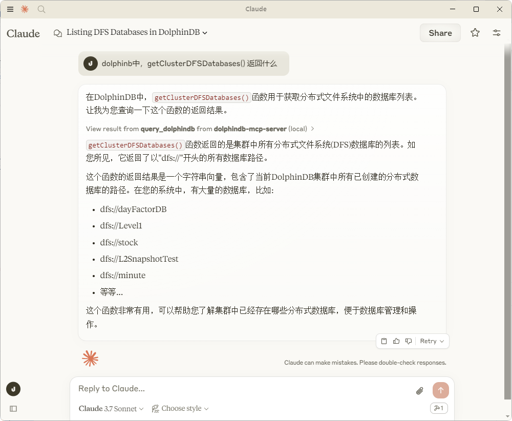

# dolphindb-mcp-server

## Quickstart

### 1.Install pkgs

We strongly recommend installing FastMCP with [uv](https://docs.astral.sh/uv/), as it is required for deploying servers:

```bash
uv pip install fastmcp dolphindb dotenv
```

### 2.Configure DolphinDB Server

```bash
cp .env.example .env
```

Update the relevant configuration parameters in the .env file to include the DolphinDB server connection details.


### 3.Install to Claude Desktop


```bash
fastmcp install demo.py
```

### 4.Test using Claude Desktop 





### 5. Add more tool


